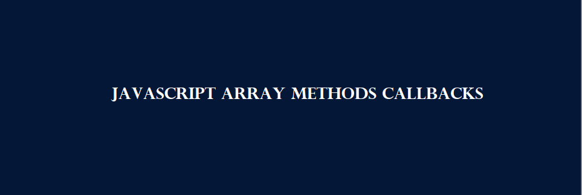

# JS_Presentation4
## Getting Started With JavaScript
> Массив — это объект, который содержит значения (любого типа), не относящиеся конкретно к именованным.
свойства/ключи, а скорее в позиции с числовым индексом
В JavaScript массив — это упорядоченный список значений. Каждое значение называется
элемент, указанный индексом. ... Во-первых, массив может содержать значения смешанных
типы.
> 

## CHANGE ELEMENTS IN ARRAY
> - Вы также можете добавлять элементы или изменять элементы, обращаясь к индексу
ценить
> - Suppose, an array has two elements. If you try to add an element at index 3
(fourth element), the third element will be undefined. For example,

## ARRAY METODS
> - pop()
> - push()
> - shift()
> - unshift()
> - toString()
> - splice()
> - reverse()
> - concat()
> - join()
> - map()
> - filter()
> - find()
> - reduce()
> - forEach()
> - sort()
> - indexOf()
> - includes()

## Add an Element to an Array
> Вы можете использовать встроенный метод push() и unshift() для добавления элементов в
множество

### push()
> .png)

### unshift()
> .png)

## Delete an Element in Array

### pop()
> .png)

### shift()
> .png)

## JavaScript array methods

### reverse()
> .png)

### concat()
> 

## JavaScript array methods

### indexOf()
> .png)

### includes()
> .png)

## JavaScript array methods

### splice()
> Splice JS Как работает
JavaScript метод splice() позволяет изменить содержимое массива за счёт удаления существующих элементов, и/или добавления новых элементов в массив. Обращаю Ваше внимание, что метод splice() изменяет существующий массив, а не возвращает новый. Удаленные элементы возвращаются как новый объект Array.
> .png)
> .png)

## JavaScript array methods

### slice()
> 
> - start
    Целое число, указывающее с какого индекса начинать выбор элементов (первый элемент имеет индекс 0). Допускается использование отрицательных значений, в этом случае индекс с которого будет произведен выбор элементов расчитывается по следующей формуле: length (длина массива) + start. Если start опущен, то значение по умолчанию будет соответствовать 0. 
> - end
    Целое число, определяющее индекс по которому заканчивать извлечение элементов массива. Если этот параметр не указан, то будут выбраны все элементы от начальной позиции start и до конца массива. Допускается использование отрицательных значений, в этом случае индекс с которого будет произведен выбор элементов расчитывается по следующей формуле: length (длина массива) + end. 
> .png)

## JavaScript array methods callbacks
> Функция обратного вызова, которая будет выполнена один раз для каждого элемента в массиве, пока не вернет true, или не достигнет конца массива, возвращая при этом undefined. Функция принимает следующие параметры:

    currentValue – значение текущего элемента.
    index – индекс массива текущего элемента.
    arr – массив, к которому принадлежит текущий элемент (по которому осуществляется проход).

> 

## JavaScript array methods

### map()
> JavaScript метод map() позволяет вызвать переданную функцию один раз для каждого элемента массива, формируя новый массив из результатов вызова этой функции.

Обращаю Ваше внимание, что функция обратного вызова, переданная в качестве параметра метода map() не будет вызвана для удалённых, или пропущенных элементов массива. Метод map() не изменяет массив для которого он был вызван (хотя функция обратного вызова может это делать).

Диапазон элементов, обрабатываемых с помощью метода map() устанавливается перед первым вызовом функции обратного вызова. Если элементы были добавлены к массиву после её вызова, то на таких элементах функция вызвана не будет.

Если значения существующих элементов массива изменяются в момент выполнения, то в качестве передаваемого значения функции будет значение в тот момент времени, когда метод map() посещает их. Если элементы удаляются до их посещения, то такие элементы посещены не будут. Если элементы, которые уже посещены, удаляются во время прохода по массиву, то более поздние элементы будут пропущены.

> .png)

## JavaScript array methods
### find()
> Возвращает значение первого элемента в массиве, который соответствует условию в переданной функции
> .png)

## JavaScript array methods
### sort()
> .png)

### Find the lowest value and highest value:
> .png)
